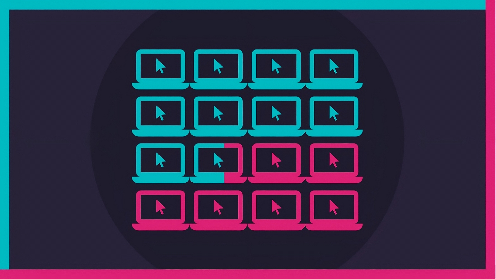

### 👨🏻‍💻 About Me

<ul>
    <li>👨🏻‍💼 My name is <code>Sumith B H</code></li>
    <li>🏠 Live in <code>Bengaluru, India</code></li>
    <li>💻 <code>Computer Science</code> student</li>
    <li>😄 Pronouns: <code>He/Him</code></li>
    <li>📫 Contact me at <code>sumith2827@gmail.com</code></li>
    <li>⚡ I like Dark Chocolates and Anime</li>
</ul>

### Badges

<b>My GitHub Stats</b>

<!--  -->
<!--
<b>Top Repositories</b>

  
  
  

 -->
<!--         -->

